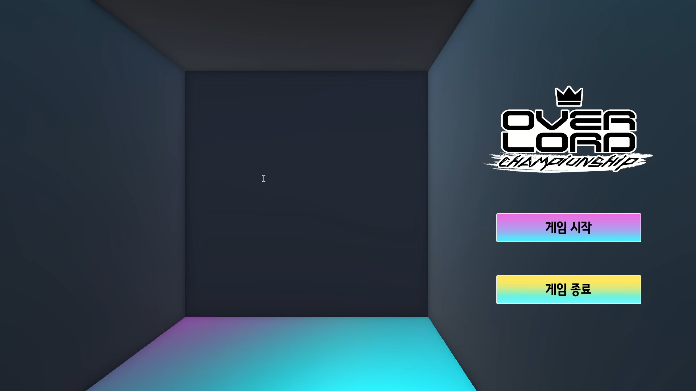

<body>
  

  
</body>

<!-- Using HTML to center the abstract -->

  

    <h2>작품 소개</h2>
    

      본 게임은 고전적인 향수를 불러 일으키는 단판제 일대일 PvE 3D 입체 격투 액션 게임으로, 전투가 주 컨텐츠입니다. 이동 범위가 제한된 좁은 스테이지에서 대전 상대로 제공되는 에너미와 제한 시간(120초) 동안 전투합니다. 플레이어는 버튼을 눌러 기본 공격을 가하거나 다양한 조작법을 활용하여 에너미의 공격을 회피할 수 있습니다. 제한 시간이 종료될 경우 점수 기준에 따라 계산된 점수가 나옵니다. 플레이어는 이 화면을 캡쳐하거나 촬영하여 점수 기록에 제출하고, 이를 통해 플레이어들의 점수가 리더보드 시트(명예의 전당)에 기재됩니다. 플레이어들은 다른 플레이어와 자신의 점수를 비교하며 경쟁심을 자극하고 더 멋진 도전을 할 수 있게 됩니다.

    

  

    <h2>스크린샷</h2>
    

    
    

    

<!-- Dataset Download Buttons -->
<!--
## SIDL Dataset 
We provide 80% of the scenes for training and learning. The remaining scenes are used for online evaluation.
### Patchify images (512x512)
For efficient training and learning, we provide patchified images. 

  <a class="button is-primary" href="https://drive.google.com/file/d/1es3rPo5Y9O96EjDVXanUY8NpaRprWH-h/view?usp=sharing" target="_blank">Train</a>
  <a class="button is-primary" href="https://drive.google.com/file/d/1u5-MDauO3XolXsU6eOARwlXo7SnpLwqA/view?usp=sharing" target="_blank">Validation</a>
  <a class="button is-primary" href="https://drive.google.com/file/d/1-SFyyjH0G3C68OfDjZ_O7M4mOqkcJdEf/view?usp=sharing" target="_blank">Test</a>

### Full-resolution images (4032x3024)

  <a class="button is-primary" href="https://drive.google.com/file/d/1s_gUw1DCqokihl3YtO3lu9_GnLZaSElI/view?usp=sharing" target="_blank">Train</a>
  <a class="button is-primary" href="https://drive.google.com/file/d/1OHxG8Jh0goKIhkJTe9NXZ6uIuD5qVaNH/view?usp=sharing" target="_blank">Validation</a>

### RAW files
We also provide RAW image files (DNG) along with metadata.

  <a class="button is-primary" href="https://drive.google.com/file/d/1k78IIsUl2eYPnPvWkBampU0qlMrW4F-u/view?usp=sharing" target="_blank">DNG images</a>
  <a class="button is-primary" href="https://drive.google.com/file/d/1lAab5F3jjCByY4OEvGSAfykyAqp2wfTi/view?usp=sharing" target="_blank">Metadata</a>

### Online Evaluation  

  <a class="button is-primary" href="http://203.253.25.170:8080" target="_blank">Click here to launch evaluation</a>

  
Click the button above to evaluate your model on the SIDL benchmark.

### ISP pipeline
Coming soon

### Citation
<pre><code class="language-bibtex">
@inproceedings{choi2025sidl,
  title     = {SIDL: A Real-World Dataset for Restoring Smartphone Images with Dirty Lenses},
  author    = {Choi, Sooyoung and Park, Sungyong and Kim, Heewon},
  booktitle = {Proceedings of the AAAI Conference on Artificial Intelligence},
  volume    = {39},
  number    = {3},
  pages     = {2545--2554},
  year      = {2025}
}
</code></pre>
-->

